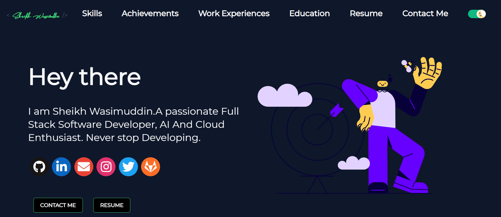

# 🌐 Sheikh Wasimuddin | Developer Portfolio Website

Welcome to my personal portfolio website! This site showcases my work as a front-end developer and web enthusiast.

---

## 📸 Preview

---

## 🚀 Features

- Responsive and modern design
- About, Projects, Skills, and Contact sections
- Resume download
- Smooth navigation with scroll animations
- Clean UI built with `DeveloperFolio` base

---

## 🧰 Tech Stack

- **Languages:** HTML, CSS, JavaScript
- **Framework:** DeveloperFolio (React-based)
- **Deployment:** GitHub Pages

My resume is available at:
📁 src/containers/greeting/sheikhwasimuddin_resume.pdf
📬 Contact Me
Email: sheikhwasimuddin786@gmail.com
GitHub: github.com/sheikhwasimuddin
LinkedIn: linkedin.com/in/sheikhwasimuddin

